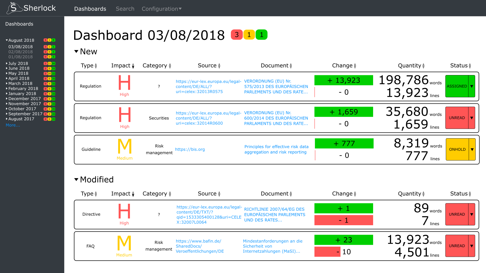
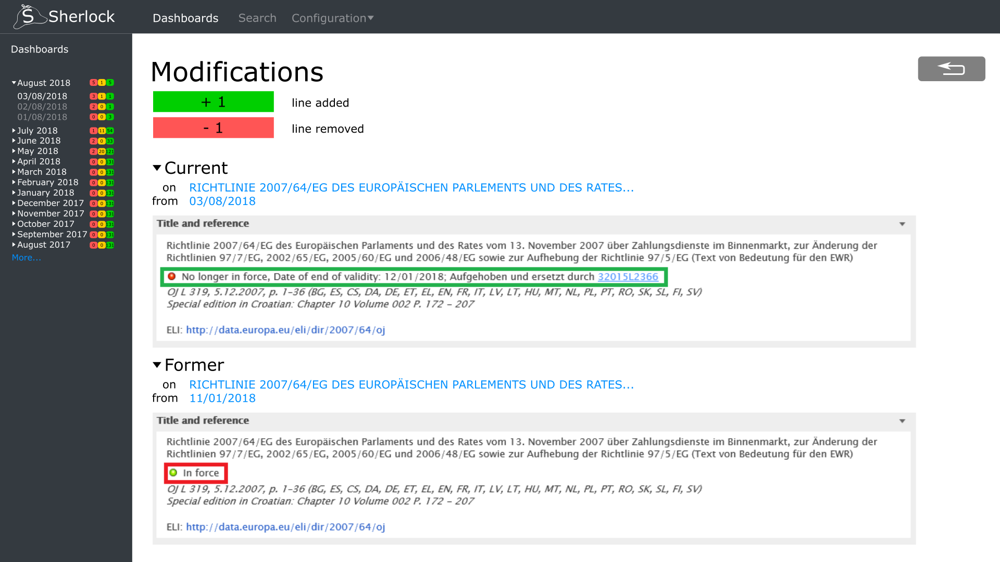
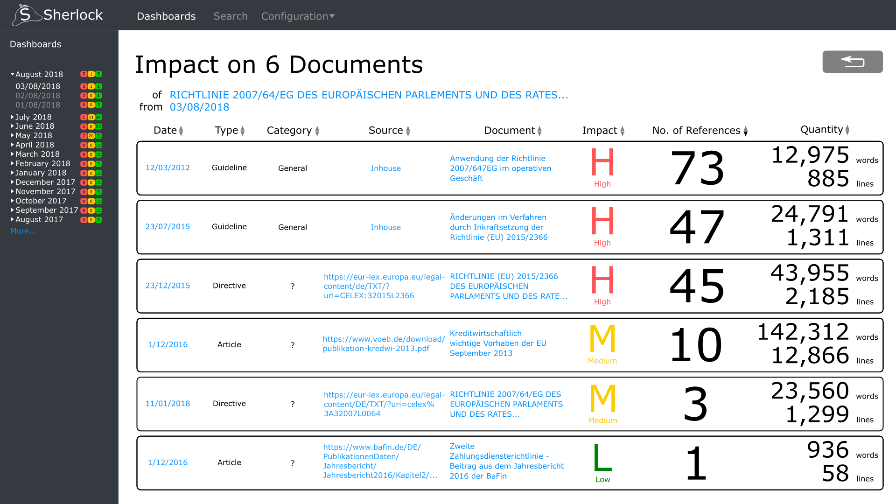

Screen Mockups
==============
Author: j.mueller <j.mueller@reply.de>
Date: 06.08.18

We have the following mockups for our User-Interface.

Dashboard
---------
The dashboard provides an overview over all documents that changed over night,
or were created in that timespan

Diff-View
---------
The diff-view is a detail-view, which can be reached by clicking on the
`change` column in the dashboard.
It shows which lines of a document were altered in comparison to the last
revision.

Impact-View
-----------
The impact-view is a detail-view, which can be reached by clicking on the
`impact` column in the dashboard.
It shows which documents reference a given document and which documents are
referenced therein.

